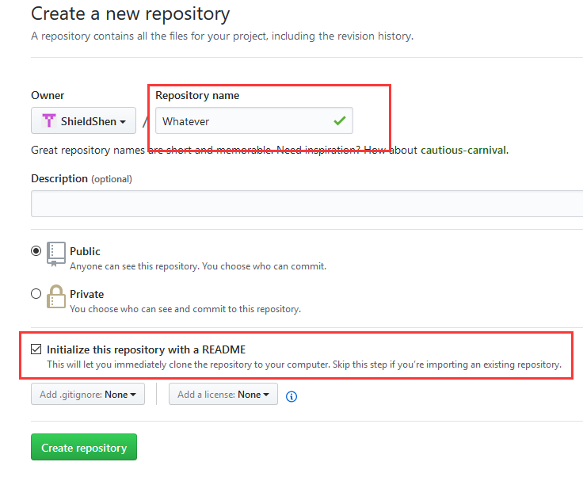
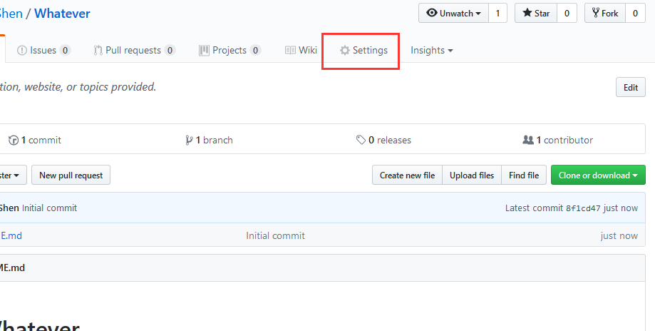
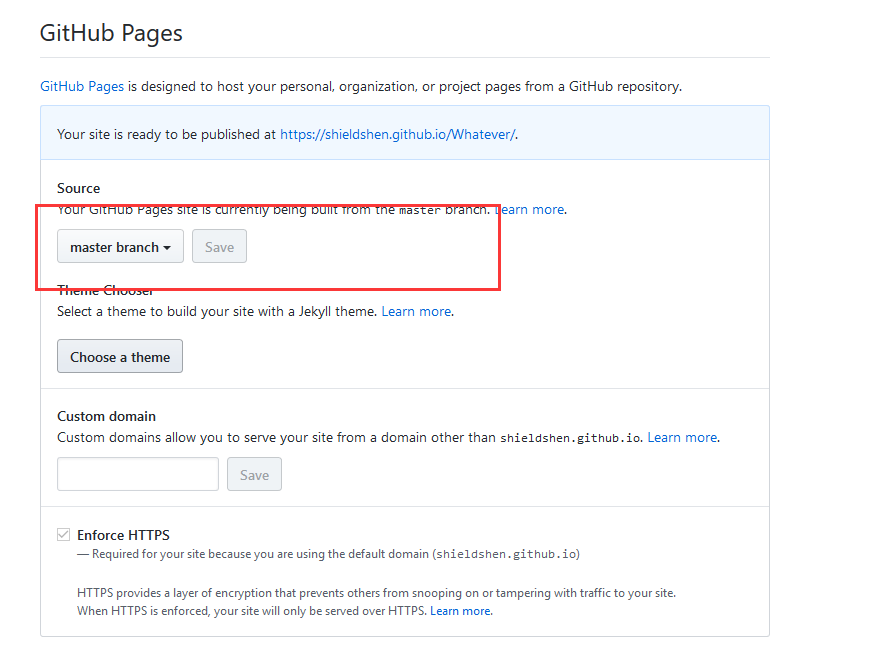
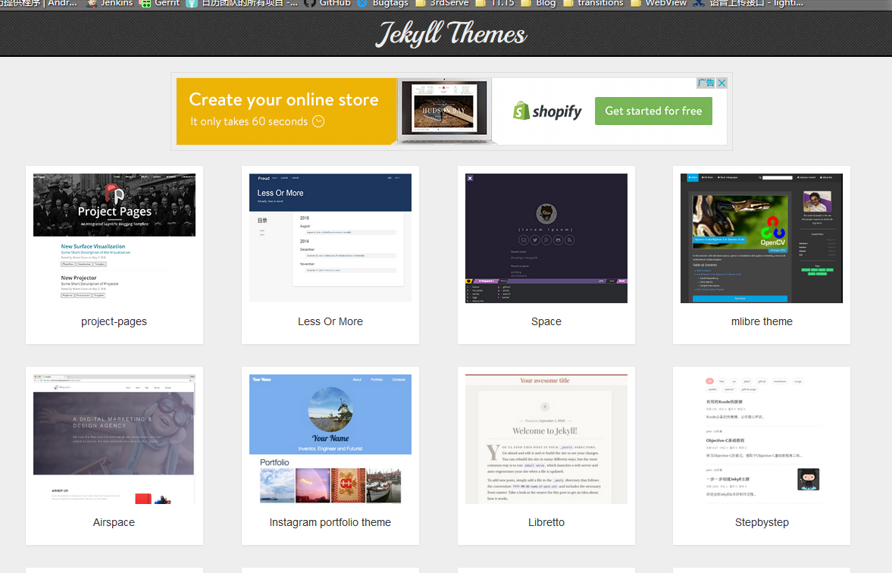
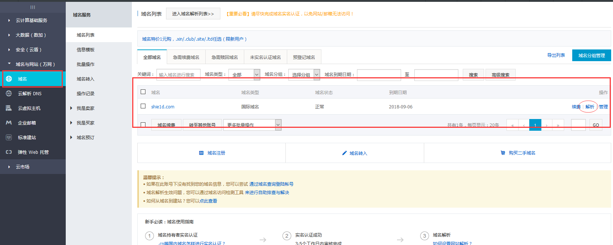
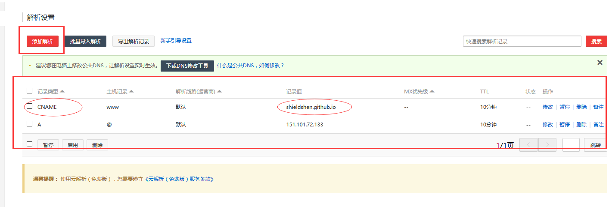
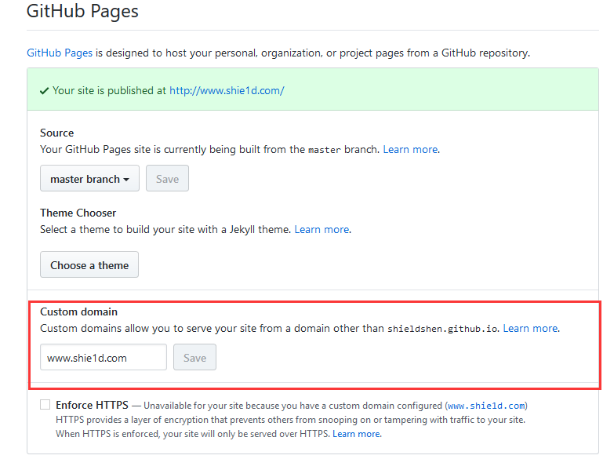

# 为什么用GitHub Pages
博主舍不得租服务器的钱，又想弄一个风格相对自由化的博客界面，而像CSDN这些博客虽然被人用了很多年，相对很稳定，但是吧，界面大家都是统一的。。而博主...就是想折腾一下。
其实我认为GitHub Pages最初出来的时候应该是用来做项目介绍用的，支持Markdown。但是这里扔个静态页面上去，假假做个博客用也没啥大问题，就是慢点...反正博主博客没人看。(／‵Д′)／~ ╧╧
而个人域名的配置就是....不想看到github上生成的一长串域名。。。当初求种像条狗，如今撸完嫌人丑( ͡° ͜ʖ ͡°)
# 关于这篇博客
其实没有什么技术相关的东西，一步一步照着做下去就好了。
# 步骤 图文详解
### 第一步
 当然是登录GitHub了，没有账号的去申请一下，该配置的配置好，网上那么多教程对吧~
### 第二步
创建一个新的仓库，因为GitHub Pages要求是`master`分支或者`gh-pages`分支再或者`master`分支上的`/docs`。我这里默认大家都是新建的仓库，想要其他方式戳右边，[怎么配置GitHub Pages](https://help.github.com/articles/configuring-a-publishing-source-for-github-pages/)。
点击创建

名字随便，`README`这个也是随便勾不勾，但是吧，作为一个开发人员，这个东西就是用来给第一次看到这个仓库的人介绍这个仓库是干啥用的，所以，写上是个好习惯~~ 

### 第三步
 创建好仓库以后，进入`Settings`做`GitHub Pages`的一些相关配置

找到`GitHub Pages`相关项，选择`master branch`然后上面就出现了网站的链接，如果你带上了`README.md`文件，那么点开链接就可以看到你的`README.md`文件的内容

### 第四步
 其实到这里GitHub Pages就完成了，如果你愿意，用`README.md`写博客也可以 d(`･∀･)b。戳这个链接[静态网页模板](http://jekyllthemes.org/) ,

你选一个喜欢的下载到本地哇。
### 第五步
有木有不会用git的啊。。。这一步就是把上一步下载到的东西解压开来，原样整个放到工程里面在push上去就可以了。不会git的送你电梯[Git简易教程](http://www.liaoxuefeng.com/wiki/0013739516305929606dd18361248578c67b8067c8c017b000)，完了之后你再点开你的GitHub Pages的地址就可以看到你下的模板的样子了。模板都是一个样子，你可以自己稍微改一改样式，不会改模板的话也没关系，会有配置文件去让你配置具体信息，一般在工程目录里面就可以找到，我下的模板就在`_config.yml`里面配置。一些个人的信息啊博客的名字啊一般都可以配置，完全不用看网页怎么写的。
### 第六步
然后就是配置域名了
* 买一个域名，去阿里云吧，方便快捷，至于怎么买。。 花钱这种事情大家都有天赋的。。。。
* 解析域名

* 配置解析信息，这个记录类型默认是`A`，`A`是用来配给服务器IP的，像GitHub这种域名之间的用`CNAME`类型，然后记录值写到你的github域名。

* 到你的GitHub 仓库里面`Settings`中找到`GitHub Pages`相关，在`Custom domain`中输入你自己的域名

### 最后
因为现在是2017/6/28，所以这个配置方法可能会随着GitHub网站改变而有所不同，但是呢，这个过程大概是不会变太多的，祝大家折腾的开心
然后没有然后了，配完就可以用了，我一个巨懒的人为什么会来写博客呢。因为闲的啊啊啊啊啊啊。

